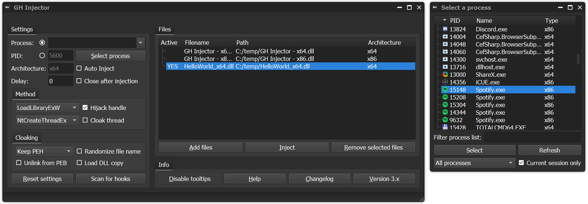

# This is an old version
- Check out the new version https://github.com/multikill/GH_Injector_MSVC_2019_QT_5_15_0

# Qt GH DLL Injector
- Rebuild Guided Hacking DLL Injector
- Download link can be found on the Release

## Picture

## How to build
- Download https://www.qt.io/download-qt-installer
- Download https://marketplace.visualstudio.com/items?itemName=TheQtCompany.QtVisualStudioTools-19123
- MSVC -> Extensions -> Qt VS Tools -> Qt Options -> Add -> SELECT YOUR DIRECTORY
- MSVC Project Settings -> Qt Project Settings -> Qt Installtion -> SELECT YOUR VERSION
- Restart MSVC to repair the intellisense

## Feature:
- Commandline interface
- Hotkeys

## ToDo:
- Recode unzip (zip_lib)
- shortcute generator

## Bugs:
- c++17 download problems!!!!
- command output does not show (only debug)
- Sort pid by number not alphabetical (not static)

## Rejected:
- No auto update on x86 version, only update check 
-- Solution 1: need to compile x86 version with open ssl 
-- Solution 2: Use URLDownloadToFile instead of QT download manager

## Credits:
- Broihon
- https://guidedhacking.com/resources/guided-hacking-dll-injector.4/
- https://github.com/Jorgen-VikingGod/Qt-Frameless-Window-DarkStyle
- https://www.codeproject.com/Articles/280650/Zip-Unzip-using-Windows-Shell
- https://github.com/jarro2783/cxxopts

## License
All original licenses of all used components Qt are respected with the additional exception that compiling, linking or using is allowed. Go to Qt website and check for License.

